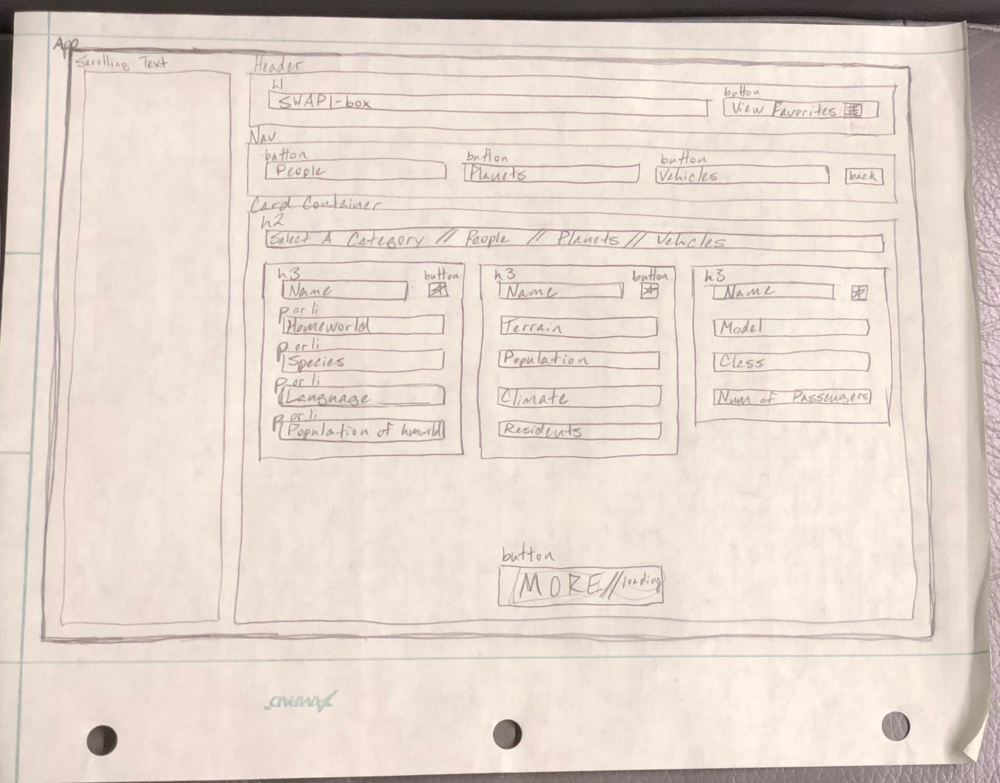

[](https://waffle.io/colehart/swapibox)

# SWAPI-box
## A React app to track your favorite Star Wars characters, planets and vehicles.

Project spec can be found [here](http://frontend.turing.io/projects/swapi-box.html).

## See it live
[](https://colehart.github.io/swapibox/)

This project was bootstrapped with [Create React App](https://github.com/facebook/create-react-app).

## Wireframe
SWAPI-box is a single page web app with different cards populating a card container depending on the selected navigation button.



## App Architecture

```
App (stateful)
|
|_ ScrollingText (stateful)
|
|_ Header (stateless)
|   |
|   |_ Button (Favorites) (stateful)
|   |
|   |_ Button (People) (stateful)
|   |
|   |_ Button (Planets) (stateful)
|   |
|   |_ Button (Vehicles) (stateful)
|
|
|_ CardContainer (stateless)
    |
    |_ Card (x n depending on API data) (stateful)
    |
    |_ Button (More) (stateful)
```
